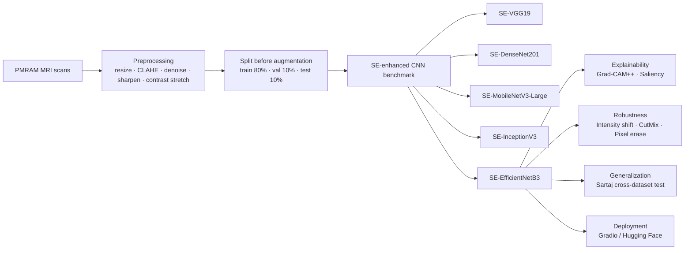

<h1 align="center">NeuroLens-XAI</h1>

<p align="center">
  <strong>Interpretable brain tumor classification from MRI using SE-enhanced EfficientNetB3</strong>
</p>

<p align="center">
  A research-grade repository for explainable brain tumor MRI analysis on the PMRAM Bangladeshi Brain MRI dataset,
  with robustness evaluation, cross-dataset testing, and a real-time demo workflow.
</p>

<p align="center">
  <a href="https://doi.org/10.3390/biomedinformatics1010000">
    
  </a>
  <a href="https://data.mendeley.com/datasets/m7w55sw88b/1">
    
  </a>
  <a href="https://huggingface.co/spaces/polash7899/Brain_tumor_mri_mdpi">
    
  </a>
  
  
  
  
</p>

<p align="center">
  
</p>

<p align="center">
  <em>Hero visual direction: grayscale axial MRI + thermal activation overlay + channel-attention geometry.</em><br/>
  <em>Animation direction: a low-opacity scan wave moving across the slice every 6–8 seconds.</em>
</p>

---

> [!IMPORTANT]
> This repository is intended for research and educational use. It is not a standalone diagnostic device.

> [!NOTE]
> The reported results are specific to the PMRAM-based experimental setup. Cross-study comparisons should be made carefully because datasets, splits, and evaluation protocols differ.

## Overview

**NeuroLens-XAI** packages an interpretable deep learning workflow for brain tumor classification from MRI.  
The repository is designed to bridge **paper-grade reproducibility** and **real-world usability** by combining:

- clinically oriented image preprocessing,
- squeeze-and-excitation (SE) enhanced CNN benchmarking,
- transparent visual explanations with Grad-CAM++ and saliency maps,
- robustness and cross-dataset evaluation,
- and an interactive Gradio-based demo workflow.
---

## Highlights

- Interpretable brain tumor MRI classification on the **PMRAM Bangladeshi Brain MRI dataset**
- Comparative benchmark across **SE-VGG19, SE-DenseNet201, SE-MobileNetV3-Large, SE-InceptionV3, and SE-EfficientNetB3**
- Best overall performance from **SE-EfficientNetB3**
- Built-in **Grad-CAM++** and **saliency map** support for visual interpretability
- Evaluation beyond accuracy: **5-fold cross-validation**, **seed stability**, **robustness to perturbations**, and **cross-dataset testing**
- Structured for both **research reproducibility** and **demo-ready deployment**

---

## Why it matters

Automated brain tumor classification is only useful when it is not merely accurate, but also **trustworthy**, **interpretable**, and **deployable**.

This repository matters because it focuses on that full stack:

1. **Regional relevance** through the PMRAM Bangladeshi MRI dataset  
2. **Model transparency** through visual explanation methods  
3. **Reliability assessment** through robustness and external evaluation  
4. **Practical usability** through an interactive web interface

---

## Method summary

| Stage | Design choice | Why it matters |
|---|---|---|
| Data conditioning | Resize, CLAHE, Gaussian smoothing, unsharp masking, contrast stretching | Improves consistency and local detail visibility |
| Model benchmark | SE-VGG19, SE-DenseNet201, SE-MobileNetV3-Large, SE-InceptionV3, SE-EfficientNetB3 | Enables fair architecture comparison |
| Best model | EfficientNetB3 with an additional SE recalibration module | Strong balance of accuracy, reliability, and efficiency |
| Explainability | Grad-CAM++ and saliency maps | Makes predictions visually inspectable |
| Reliability analysis | Holdout test, 5-fold CV, seed study, perturbation testing, cross-dataset evaluation | Supports stronger trust in generalization |
| Delivery | Gradio application deployable on Hugging Face | Moves the work from paper to interaction |

---

## Architecture / workflow




---

## Repository structure

```text
NeuroLens-XAI/
├── assets/
├── configs/
├── data/
├── demo/
├── docs/
├── examples/
├── models/
├── notebooks/
├── requirements/
├── results/
├── scripts/
├── src/neuro_lens_xai/
├── tests/
├── CITATION.cff
├── LICENSE
├── pyproject.toml
└── README.md
```

Key folders:

- `src/neuro_lens_xai/` — core package for preprocessing, training, evaluation, and XAI
- `configs/` — reproducible experiment settings
- `results/` — metrics, curves, confusion matrices, XAI outputs, and logs
- `demo/` — Gradio app and Hugging Face packaging
- `docs/` — methodology, reproducibility notes, and deployment documentation
- `assets/` — banner, figures, icons, and lightweight animations for GitHub presentation

---

## Installation

### 1) Clone the repository

```bash
git clone https://github.com/your-org/neurolens-xai.git
cd neurolens-xai
```

### 2) Create an environment

```bash
python -m venv .venv
source .venv/bin/activate
```

### 3) Install dependencies

```bash
pip install -r requirements/base.txt
pip install -r requirements/demo.txt
pip install -e .
```

---

## Quick start

### Prepare the PMRAM dataset

```bash
python scripts/prepare_pmr_data.py \
  --input-dir /path/to/pmram_raw \
  --output-dir data/processed/pmram
```

### Train the recommended model

```bash
python scripts/train.py \
  --config configs/model/se_efficientnetb3.yaml \
  --data-root data/processed/pmram \
  --output-dir models/checkpoints/se_efficientnetb3
```

### Evaluate on the holdout test set

```bash
python scripts/evaluate.py \
  --config configs/eval/test.yaml \
  --checkpoint models/checkpoints/se_efficientnetb3/best.ckpt \
  --data-root data/processed/pmram \
  --output-dir results/metrics/se_efficientnetb3
```

### Generate Grad-CAM++ visualizations

```bash
python scripts/visualize_gradcam.py \
  --checkpoint models/checkpoints/se_efficientnetb3/best.ckpt \
  --input-dir examples/mri_samples \
  --output-dir results/xai/gradcam_examples
```

### Run cross-dataset evaluation

```bash
python scripts/cross_dataset_eval.py \
  --checkpoint models/checkpoints/se_efficientnetb3/best.ckpt \
  --source-root data/processed/pmram \
  --target-root data/external/sartaj \
  --output-dir results/cross_dataset/sartaj
```

### Launch the demo app

```bash
python scripts/launch_demo.py \
  --checkpoint models/checkpoints/se_efficientnetb3/best.ckpt
```

---

## Dataset

### Primary dataset
**PMRAM: Bangladeshi Brain Cancer—MRI Dataset**

### External evaluation dataset
**Sartaj brain tumor dataset**

| Dataset | Role | Composition | Notes |
|---|---|---|---|
| PMRAM | Primary training / validation / test dataset | 1,600 grayscale MRI images across Glioma, Meningioma, Pituitary, and Normal | Balanced four-class setup |
| Sartaj | Cross-dataset evaluation | External brain tumor MRI dataset | Used without retraining or fine-tuning for transferability analysis |

### Recommended data protocol

- Split **before augmentation**
- Use **80 / 10 / 10** train / validation / test
- Apply augmentation **only to the training set**
- Keep validation and test sets restricted to original images
- Do not commit raw medical images to the repository
- Follow the original dataset license and citation requirements

---

## Experimental setup

| Parameter | Setting |
|---|---|
| Recommended model | SE-EfficientNetB3 |
| Input size | 300 × 300 |
| Batch size | 32 |
| Epochs | 50 |
| Early stopping patience | 7 |
| Optimizer | AdamW |
| Learning rate | 1e-4 |
| Weight decay | 1e-4 |
| LR scheduler | ReduceLROnPlateau |
| Scheduler patience | 2 |
| Scheduler factor | 0.5 |
| Dropout rate | 0.2 |
| SE reduction ratio | 16 |
| Reference hardware | NVIDIA Tesla P100 |

---

## Results

### Comparative model performance on PMRAM

| Model | Accuracy | Precision | Recall | F1-score |
|---|---:|---:|---:|---:|
| SE-VGG19 | 96.75% | 96.91% | 96.75% | 96.76% |
| SE-DenseNet201 | 98.05% | 98.07% | 98.05% | 98.05% |
| SE-InceptionV3 | 96.10% | 96.10% | 96.10% | 96.08% |
| SE-MobileNetV3-Large | 97.40% | 97.43% | 97.40% | 97.40% |
| **SE-EfficientNetB3** | **98.70%** | **98.77%** | **98.70%** | **98.70%** |

### Additional findings

- **5-fold cross-validation accuracy:** 96.89% ± 2.44%
- **Inference time:** approximately 2–4 seconds per image in the reported deployment
- **Seed-wise stability:** 98.57% ± 0.26% average accuracy across tested seeds
- **Ablation without SE:** 96.10% accuracy
- **Robustness under perturbations:**  
  - Intensity shift: 98.70%  
  - CutMix patch mix: 96.75%  
  - Pixel erase: 96.10%

### Cross-dataset note

The cross-dataset evaluation on Sartaj suggests stable transfer for several classes, with more noticeable confusion in the **Meningioma** category. This should be interpreted as a useful generalization signal rather than a claim of full cross-institutional robustness.

### Benchmark integrity note

Although SE-EfficientNetB3 is the strongest model in this study, this repository avoids overclaiming universal superiority. The results are most meaningful within the reported PMRAM-centered experimental protocol.

---

## Use cases / applications

- Research benchmarking for interpretable medical imaging models
- Reproducible comparison of SE-enhanced CNN backbones
- Explainable AI demonstrations for brain MRI classification
- Educational use in deep learning, radiology AI, and XAI courses
- Prototype clinical decision-support interfaces
- Baseline extension point for external validation and multimodal MRI research

---

## Research to real-world impact

| Research layer | Repository deliverable | Practical value |
|---|---|---|
| Dataset-aware experimentation | Structured PMRAM pipeline | Region-specific benchmarking |
| Transparent modeling | Grad-CAM++ and saliency modules | Better auditability and trust |
| Reliability analysis | Robustness, seed, and cross-dataset scripts | Stronger evidence beyond headline accuracy |
| Deployment pathway | Gradio demo and Hugging Face packaging | Easier stakeholder interaction |

This is the intended character of the repository: **not just a model checkpoint, but a complete research-to-application scaffold**.

---

## Reproducibility

To support consistent results, this repository should maintain:

- configuration-driven experiments under `configs/`
- fixed train / validation / test split logic
- augmentation restricted to the training set
- logged random seeds and run metadata
- saved checkpoints and exported metrics
- notebook-based qualitative analysis alongside script-based evaluation
- clearly versioned dependencies
- explicit documentation for external dataset evaluation

Recommended reproducibility artifacts:

- `CITATION.cff`
- `requirements/`
- `results/logs/`
- `docs/reproducibility/experiment_registry.md`

---

## Roadmap

- [ ] Release cleaned training and evaluation configs
- [ ] Add subject-wise or patient-aware validation when metadata permits
- [ ] Extend external validation to larger multi-institutional cohorts
- [ ] Support multimodal MRI inputs
- [ ] Add ONNX / TorchScript export for deployment workflows
- [ ] Add Docker support for reproducible serving
- [ ] Add DICOM-friendly ingestion pipeline
- [ ] Publish a formal model card and data card

---

## Citation

If this repository contributes to your work, please cite the paper:

```bibtex
@article{polash2026interpretable,
  title   = {An Interpretable Deep Learning Approach for Brain Tumor Classification Using a Bangladeshi Brain MRI Dataset},
  author  = {Polash, Md. Saymon Hosen and Saykat, Md. Tamim Hasan and Haque, Md. Ehsanul and Maniruzzaman, Md. and Zabin, Mahe and Uddin, Jia},
  journal = {BioMedInformatics},
  year    = {2026},
  doi     = {10.3390/biomedinformatics1010000}
}
```

---

## Acknowledgement

This repository builds on:
- the PMRAM Bangladeshi Brain Cancer—MRI Dataset,
- the reported SE-enhanced CNN benchmarking framework,
- Grad-CAM++ and saliency-based explainability workflows,
- and Gradio / Hugging Face tooling for interactive demonstration.

Please retain attribution for any reused figures, assets, or dataset references.

---

## Contact

For repository maintenance, collaboration, or technical discussion:

- Maintainer: `Md. Tamim Hasan Saykat`
- Email: `2022-1-60-289@std.ewubd.edu`
- Issues: GitHub Issues
- Discussions: GitHub Discussions

---

## License

Recommended license: **Apache-2.0** for code.

Please note:
- the dataset remains subject to its original license and terms,
- any reused paper figures should preserve proper attribution,
- medical or research claims should remain aligned with the published study.

---
